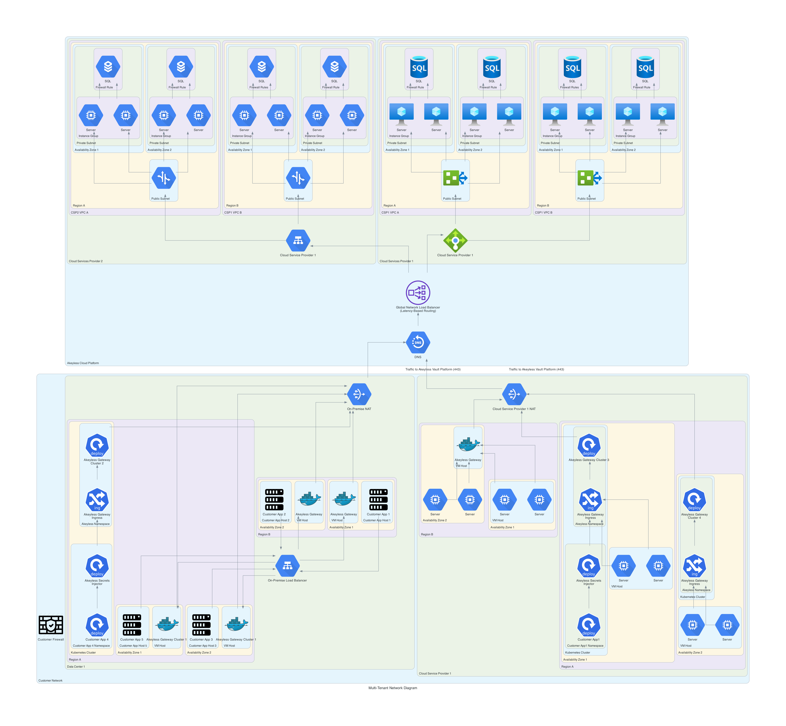
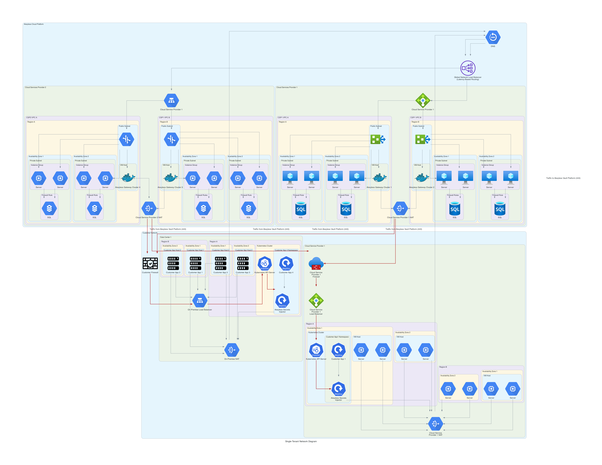

# Akeyless Network Diagram Generator

## Multi-tenant Network Diagram



## Single-tenant Network Diagram



## Installation

```bash
pip3 install -r requirements.txt
```

## Usage

### For Multi-tenant network diagrams

```bash
python3 multi-tenant-network.py|
```

### For Single-tenant network diagrams

```bash
python3 single-tenant.py
```
